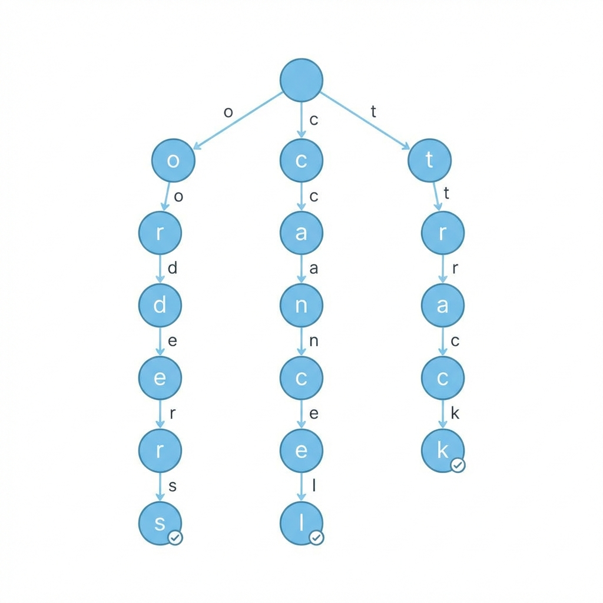
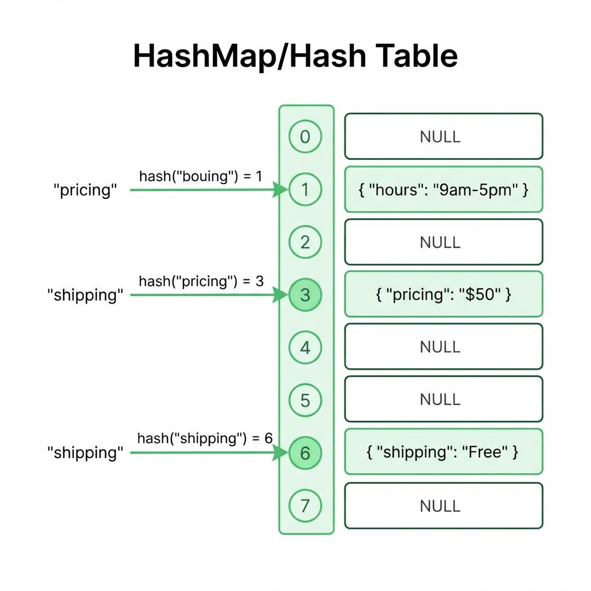
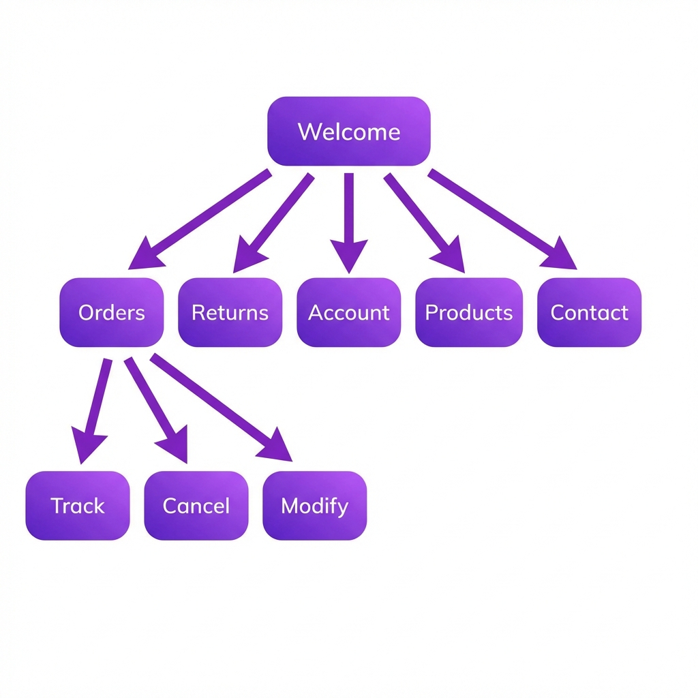
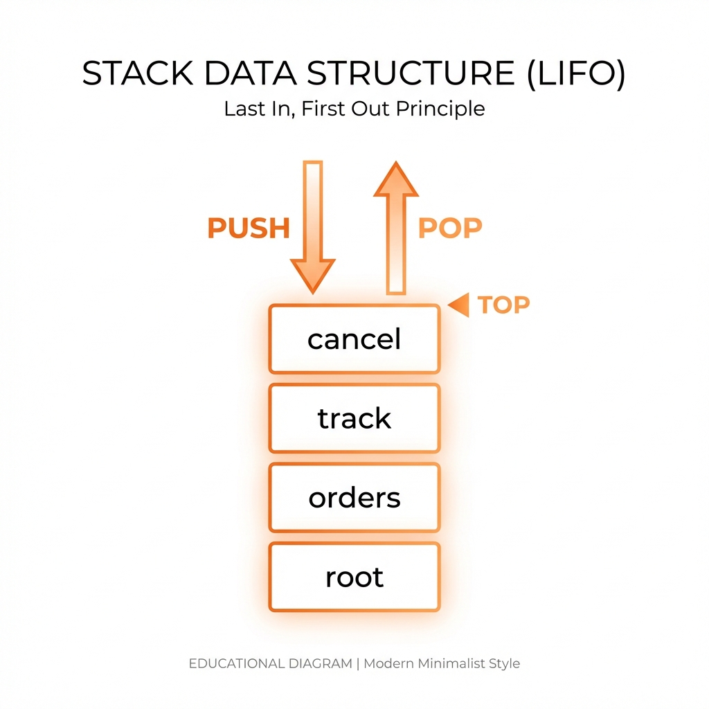
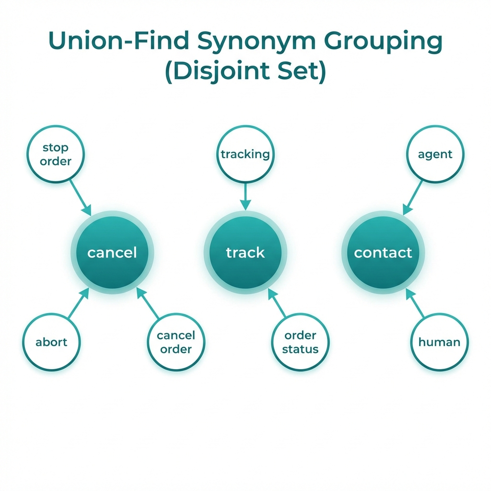
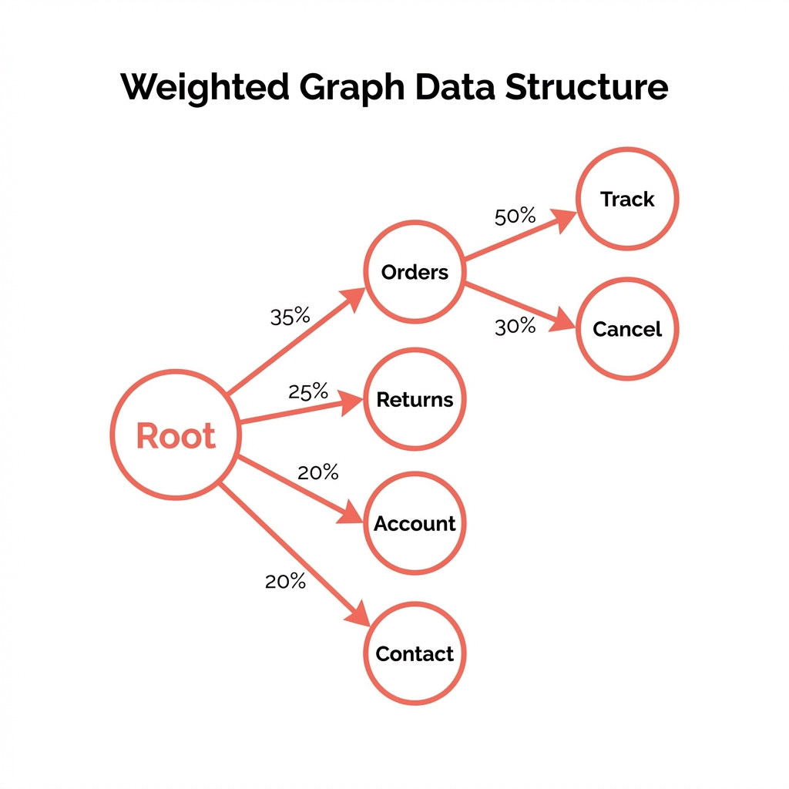

# Customer Support Chatbot - Visual Walkthrough

A complete visual guide to the 6 data structures powering this chatbot.

---

## 1. Trie (Prefix Tree) - Auto-Complete

**Purpose:** Provides real-time suggestions as users type.



### How It Works

The Trie stores keywords character by character. When you type "ord", it traverses:
- Root → 'o' → 'r' → 'd'
- Returns all words below: "order", "orders", "order status"

### Demo

1. Type `ord` in the input field (don't press Enter)
2. Watch suggestions appear instantly
3. The sidebar "Trie" item lights up

### Time Complexity
- **Insert:** O(word_length)
- **Search:** O(prefix_length + matches)

---

## 2. HashMap - O(1) FAQ Lookup

**Purpose:** Instant retrieval of frequently asked questions.



### How It Works

Keywords are hashed to bucket indices for O(1) average lookup:
- `hash("pricing")` → Bucket 3 → Returns pricing info
- `hash("shipping")` → Bucket 6 → Returns shipping info

### Demo

1. Type `pricing` and press Enter
2. Get instant FAQ response
3. Badge shows "Used: HashMap"

### Other Keywords
- `shipping` - Delivery times
- `hours` - Business hours
- `payment` - Payment methods
- `discount` - Current promotions

---

## 3. Decision Tree - Conversation Flow

**Purpose:** Manages branching conversation paths.



### How It Works

Each node represents a conversation state with defined options:
- "Welcome" → user types "orders" → "Orders Menu"
- "Orders Menu" → user types "track" → "Track Order"

### Demo

1. Type `orders` → Navigate to Orders Menu
2. Type `track` → Go to Track Order
3. Type `cancel` → Go to Cancel Order
4. Each step shows different options

### Navigation
- Type any option keyword to navigate
- Type `back` to go up one level
- Type `menu` to return to root

---

## 4. Stack - Go Back Navigation

**Purpose:** Enables LIFO (Last In, First Out) backtracking.



### How It Works

Every navigation pushes state onto the stack:
1. Start: Stack = [root]
2. Type "orders": Stack = [root, orders]
3. Type "track": Stack = [root, orders, track]
4. Type "back": Pop → Stack = [root, orders]

### Demo

1. Navigate: `orders` → `track` → `cancel`
2. Type `back` → Returns to previous screen
3. Type `back` again → Goes back further
4. Badge shows "Used: Stack"

### LIFO Principle
- Last state added is first removed
- Perfect for "undo" functionality

---

## 5. Union-Find - Synonym Grouping

**Purpose:** Groups equivalent intents under canonical names.



### How It Works

Multiple phrases map to the same canonical intent:
- "stop order" → find() → "cancel"
- "abort" → find() → "cancel"
- "cancel order" → find() → "cancel"

All trigger the same cancel flow!

### Demo

1. Type `stop order` → Goes to cancel flow
2. Reset conversation
3. Type `abort` → Same cancel flow!
4. Badge shows "Used: Union-Find"

### Synonym Groups

| Canonical | Synonyms |
|-----------|----------|
| cancel | stop order, abort, cancel order |
| track | tracking, where is my order, order status |
| contact | agent, human, speak to someone |
| return | refund, money back, send back |

---

## 6. Weighted Graph - Quick Actions

**Purpose:** Suggests next best actions based on probability weights.



### How It Works

Each state has outgoing edges with weights (probabilities):
- From "Orders Menu":
  - Track Order: 50%
  - Cancel Order: 30%
  - Modify Order: 15%
  - Back to Menu: 5%

Top 3 are shown as clickable buttons!

### Demo

1. Type `orders` → See Quick Action buttons
2. Buttons show: "Track Order (50%)", "Cancel Order (30%)"
3. Click any button to navigate
4. Actions update based on current screen

---

## Complete Demo Flow

Follow this sequence to showcase all 6 data structures:

| Step | Type | Data Structure |
|------|------|----------------|
| 1 | `ord` (no Enter) | **Trie** - Suggestions appear |
| 2 | `pricing` + Enter | **HashMap** - FAQ lookup |
| 3 | `orders` + Enter | **Decision Tree** - Navigation |
| 4 | `track` + Enter | **Decision Tree** - Deeper |
| 5 | `back` + Enter | **Stack** - Go back |
| 6 | `stop order` + Enter | **Union-Find** - Synonym |
| 7 | Click "Track Order (50%)" | **Weighted Graph** - Action |

---

## Architecture Overview

```
User Input
    │
    ▼
┌─────────┐   ┌─────────┐   ┌─────────┐
│  Trie   │ → │ Union-  │ → │ HashMap │
│ (auto-  │   │  Find   │   │  (FAQ)  │
│complete)│   │(synonym)│   │         │
└─────────┘   └─────────┘   └─────────┘
                  │              │
                  ▼              ▼
             ┌─────────┐   ┌─────────┐
             │Decision │   │  Stack  │
             │  Tree   │ ← │ (back)  │
             └─────────┘   └─────────┘
                  │
                  ▼
             ┌─────────┐
             │Weighted │
             │ Graph   │
             │(suggest)│
             └─────────┘
                  │
                  ▼
            Response + Quick Actions
```

---

## Files Reference

| File | Purpose |
|------|---------|
| `backend/data_structures.py` | All 6 data structure implementations |
| `backend/support_engine.py` | Orchestrates data structures |
| `backend/server.py` | HTTP API endpoints |
| `frontend/index.html` | Chat interface |
| `frontend/app.js` | Frontend logic |
| `frontend/styles.css` | Styling |
| `DATA_STRUCTURES.md` | Detailed technical documentation |

---

## Running the Demo

```bash
cd "/Users/aarushluthra/Documents/customer support"
python3 main.py
# Open http://localhost:8000
```
